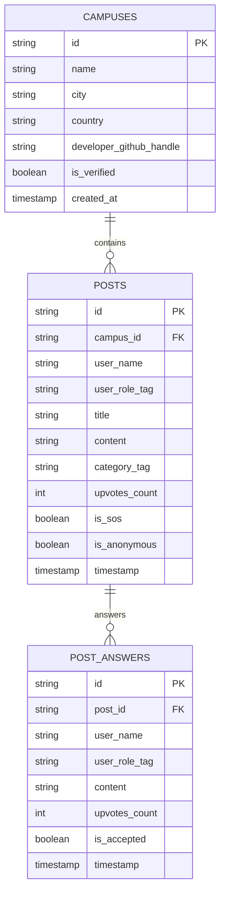

# 🌐 Nexus: CampusPulse Global

> **Built for the "First Commit" Hackathon**  
> An interconnected global campus micro-network where university students can search any college worldwide, monitor real-time multi-tier notification feeds, broadcast urgent crowdsourced SOS queries with anonymous identity masking, and empower student developers globally to spin up new campus nodes.

---

## ⚡ Live Features Matrix

### 1. Global Navigation & Multi-Campus Search
* **Worldwide Instant Filtering**: Real-time search across colleges worldwide (e.g. *Polaris School of Technology, Bangalore*, *MANIT / RGPV Bhopal*, *IIT Bombay*, *Stanford*, *NUS Singapore*, *Oxford*).
* **"Home Campus" vs. "Peeking Mode"**: Set your primary campus (e.g., Bhopal) with a quick-switch toggle to peek into foreign campus feeds without losing your home state.
* **Peeking Banner**: Instant visual indicator with a 1-click button to return to your Home Campus.

### 2. Multi-Tier Unified Feed ("The Pulse")
* **Strict Filter Rule**: All client-side feeds strictly filtered by the active `campus_id`.
* **Verification Badges Matrix**:
  * 🔵 **Blue Badge (`admin`)**: Official College Administration notices & circulars.
  * 🟢 **Green Badge (`club`)**: Registered Student Club & Society announcements.
  * ⚪ **Gray Badge (`student`)**: General Student posts & discussions.
* **Category Filters**: `[Official Alert]`, `[Fest/Events]`, `[Lost & Found]`, `[Exam Preparation]`.
* **Broadcast Modal**: Post notices with designated verification roles.

### 3. Peer-to-Peer "SOS Query" Hub
* **Urgent Crowdsourced Solutions**: Dedicated tab for high-stakes problem-solving (exam cheat sheets, syllabus changes, emergency accommodation).
* **🕶️ Anonymous Identity Masking Toggle**: Enables students to post sensitive queries without fear of exposure.
* **🔥 Dynamic Upvote Re-Sorting**: Community upvoting dynamically ranks peer solutions, floating the highest-voted answer directly to the top of the thread.

### 4. Global Developer Portal ("Spin up a Campus")
* **Node Deployment Form**: Allows developers globally to register their college node.
* **Required Verification Inputs**:
  * Developer Full Name
  * University Domain Email (e.g., `.edu` / institutional email)
  * GitHub Profile URL
  * Campus Name, City, and Country
* **Instant Activation**: Newly registered campuses are immediately available in the global search dropdown.

---

## 🛠️ Unified Database Schema (Hackathon Speed Hack)

Instead of fragmenting databases across institutions, Nexus utilizes a unified database schema:



The production SQL migration script is ready in [`supabase/schema.sql`](supabase/schema.sql) with full Row Level Security (RLS) policies and seed data.

---

## 🚀 1-Click Vercel Deployment

1. Push this repository to your GitHub account:
   ```bash
   git init
   git add .
   git commit -m "feat: initial commit for First Commit Hackathon"
   git remote add origin https://github.com/your-username/nexus.git
   git branch -M main
   git push -u origin main
   ```
2. Go to [Vercel](https://vercel.com/new) and import the repository.
3. Vercel will automatically detect the **Next.js** framework via `vercel.json` and build with zero extra configuration.
4. *(Optional)* Add Supabase environment variables if connecting to a live PostgreSQL cluster:
   * `NEXT_PUBLIC_SUPABASE_URL`
   * `NEXT_PUBLIC_SUPABASE_ANON_KEY`
5. Click **Deploy**!

---

## 💻 Local Development Setup

Ensure you have **Node.js 18+** installed.

```bash
# 1. Install dependencies
npm install

# 2. Run local development server
npm run dev

# 3. Open in your browser
http://localhost:3000
```

---

## 📱 Mobile Web Optimization

Designed mobile-first with:
* Native-like bottom dock (`The Pulse`, `SOS Hub`, `Switch`, `Spin Node`)
* Touch-friendly card actions & copy-link buttons
* Fast autocomplete search with click-outside dismiss
